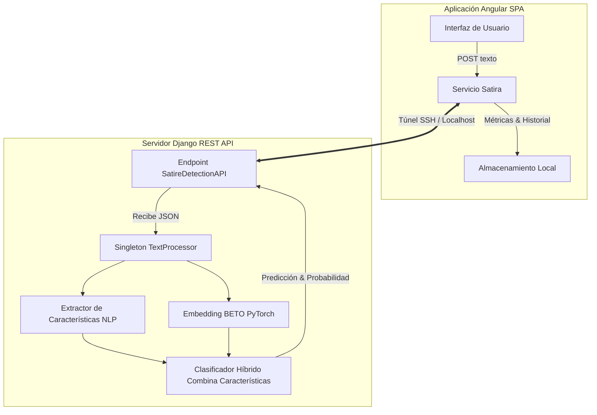

# Detector de sátira en español 🎭

[](https://www.python.org/)
[](https://angular.dev/)
[](https://www.djangoproject.com/)
[](https://huggingface.co/dccuchile/bert-base-spanish-wwm-uncased)

Un clasificador diseñado para la detección automática de textos satíricos en español, que combina la potencia del modelo Transformer **BETO** (BERT adaptado al español) con **19 características lingüísticas** (sintácticas, fraseológicas y semánticas) extraídas mediante **spaCy** y **NLTK**, optimizadas a través de un proceso de selección de características (*feature selection*).

---

## Arquitectura del sistema

El proyecto está diseñado bajo una arquitectura desacoplada, facilitando su despliegue local o híbrido (ejecución del modelo pesado en la nube con consumo desde el cliente local).



### Componentes principales

*   **Frontend (SPA en Angular):** Ofrece una interfaz de usuario interactiva y optimizada en tema oscuro. Incluye un detector dinámico con indicador de probabilidad, una base de datos local para el historial de análisis y una sección de metodología detallada que incluye la matriz de confusión interactiva y las métricas científicas.
*   **Backend (REST API en Django):** Implementa un servicio de inferencia de alto rendimiento. Cuenta con el patrón (*eager loading*) del modelo PyTorch y el pipeline de spaCy utilizando el patrón de diseño **Singleton**, protegido bajo exclusión mutua para asegurar la estabilidad en consultas concurrentes.
*   **Pipeline de entrenamiento (Jupyter Notebooks / Colab):** Scripts estructurados para la preparación de datos, entrenamiento distribuido con GPU T4, validación de pérdida cruzada y exposición dinámica del servidor mediante túneles SSH automáticos (`pinggy`/`serveo`).

---

## Dataset y rendimiento

### Dataset consolidado (7,200 muestras)
Para entrenar y evaluar el clasificador, se consolidó un dataset balanceado de **7,200 registros en español**:
1.  **Corpus base (6,000 registros):** Transcripciones y textos extraídos del corpus original *SatiSPeech* (noticias reales y sátiras políticas).
2.  **Dataset de refuerzo (1,200 registros):** Frases cotidianas neutrales (rutinas, clima, cocina) y textos satíricos/sarcásticos cotidianos (parodias de tecnología, deportes y redes sociales) obtenidos de redes sociales e inyectados con el propósito de mitigar el sesgo de dominio del modelo y mejorar la generalización fuera de muestra.

### Métricas de rendimiento real (Partición 80/20)
Evaluado sobre un conjunto de validación de **1,440 muestras**:

| Métrica | Rendimiento | Descripción |
| :--- | :---: | :--- |
| **Exactitud (Accuracy)** | **87.01%** | Proporción total de aciertos sobre el corpus de test. |
| **F1-Score (Sátira)** | **86.56%** | Balance óptimo entre la precisión y la sensibilidad. |
| **Precisión (Clase Sátira)** | **85.75%** | Tasa de aciertos reales entre los casos etiquetados como sátira. |
| **Sensibilidad (Recall)** | **87.37%** | Capacidad del modelo para capturar la sátira existente. |

### Matriz de confusión
```
                      Predicho Neutro      Predicho Sátira
Actual Neutro         651 (TN)             100 (FP)
Actual Sátira          87 (FN)             602 (TP)
```

---

## Instalación y ejecución local

> [!NOTE]
> Se recomienda contar con Python 3.10+ y Node.js 18+ instalados en el sistema antes de iniciar.

### 1. Clonar el repositorio
```bash
git clone https://github.com/luisknight24/DeteccionSatira.git
cd DeteccionSatira
```

### 2. Configurar el Backend (Django)
Desde la raíz del proyecto, ingresa a la carpeta del backend, crea tu entorno virtual y arranca el servidor:
```bash
cd satire_detector_api
python -m venv venv
# Activar entorno (Windows)
.\venv\Scripts\activate
# Activar entorno (macOS/Linux)
source venv/bin/activate

# Instalar dependencias
pip install -r requirements.txt
python -m spacy download es_core_news_sm
python initialize_nltk.py

# Arrancar servidor de desarrollo
python manage.py runserver 8000
```

### 3. Configurar el Frontend (Angular)
Desde una nueva terminal en la raíz del proyecto:
```bash
cd Frontend
npm install
npm run start
```
Abre tu navegador en `http://localhost:4200/` para interactuar con la aplicación.

---

## ☁️ Ejecución híbrida (Google Colab con GPU)

Si tu máquina local no dispone de una GPU compatible y quieres evitar retrasos en la inferencia del modelo BETO, el proyecto está completamente preparado para correr en **Google Colab**:

1.  Abre el cuaderno de Jupyter [iniciar_servidor_colab.ipynb](iniciar_servidor_colab.ipynb) en Google Colab.
2.  Selecciona un entorno de ejecución con **GPU T4** (Entorno de ejecución -> Cambiar tipo de entorno de ejecución).
3.  Ejecuta secuencialmente las celdas para clonar el repositorio, instalar dependencias, realizar el re-entrenamiento del modelo y levantar el servidor backend de Django.
4.  El script generará un túnel SSH seguro mediante **pinggy.io** o **serveo.net** y te proporcionará una URL pública (ej. `https://xxxx.pinggy.link/`).
5.  En el frontend de Angular (abierto localmente en tu navegador), haz clic en el icono de **Engranaje (Configuración)** en la esquina superior derecha, pega esa URL del túnel y haz clic en Guardar. El frontend se conectará al instante con la GPU en la nube.

---

## 🔌 Documentación de la API REST

El backend de Django expone un servicio REST para realizar análisis en tiempo real.

### Endpoint: Detección de sátira
*   **URL:** `/api/satire-detection/`
*   **Método:** `POST`
*   **Cabeceras:** `Content-Type: application/json`

#### Solicitud (Payload):
```json
{
  "text": "Los semáforos de la ciudad han decidido tomarse unas vacaciones indefinidas. Ahora cruzar la calle es un deporte extremo olímpico."
}
```

#### Respuesta (JSON):
```json
{
  "prediction": "satire",
  "probability": 94.85,
  "metrics": {
    "irony_score": 0.68,
    "LexicalDiversity": 0.82,
    "Flesch Score": 52.40,
    "Unusual Word Frequency": 0.15,
    "prop_NOUN": 0.24,
    "prop_VERB": 0.18,
    "prop_ADJ": 0.12
  }
}
```

---

## 📂 Estructura del repositorio

```
DeteccionSatira/
├── Frontend/                 # Código fuente de la SPA en Angular
│   ├── src/app/components/   # Componentes: detector, historial, metodología
│   └── src/app/services/     # Consumo de la API y lógica del historial
├── satire_detector_api/       # API REST en Django
│   ├── detector/             # Vistas de inferencia, serializadores y lógica NLP
│   │   └── utils/            # Cargador del modelo (BETO) y extractor de características
│   └── static/               # Serializadores locales de características (.pkl)
├── colab_notebooks/          # Cuadernos Jupyter del flujo experimental de machine learning
├── documentos_origen/        # Datasets originales de SatiSPeech y validaciones
└── iniciar_servidor_colab.ipynb  # Cuaderno integrador para Google Colab
```

*Desarrollado por [Luis Balladares](https://www.linkedin.com/in/luis-balladares).*
