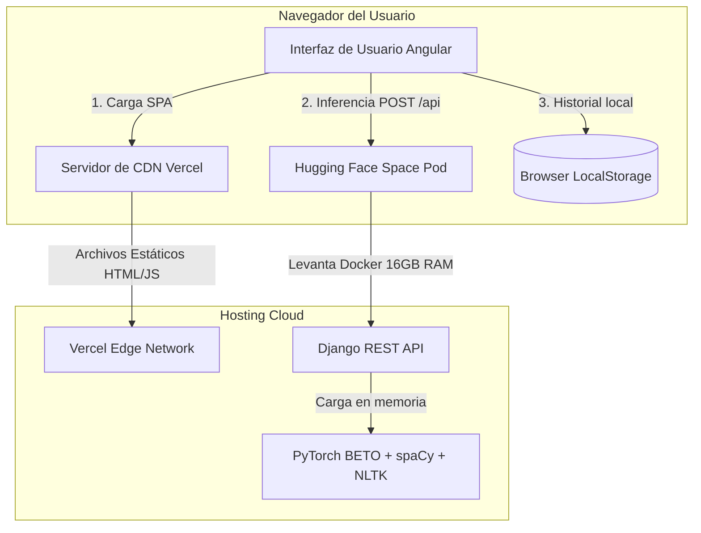

# 🎭 Roadmap de Despliegue en la Nube - Clasificador de Sátira

Este documento detalla la estrategia, evaluación y pasos técnicos necesarios para alojar la aplicación de detección de sátira en español en producción de forma económica o gratuita, resolviendo las limitaciones de hardware del backend (modelo BETO de ~443MB) y garantizando una URL de backend estática y permanente.

---

## 1. Arquitectura de Despliegue Propuesta

La arquitectura de producción separa completamente el frontend estático y el backend de inferencia pesada, permitiendo que ambos escalen o se actualicen de manera independiente sin incurrir en costes de servidor.



---

## 2. Evaluación de Plataformas de Hosting

### Backend (Requerimiento: ~1.5GB RAM para PyTorch + BETO + spaCy)

| Proveedor | Plan / Costo | RAM / CPU | Pros | Contras | ¿Elegido? |
| :--- | :--- | :--- | :--- | :--- | :--- |
| **Hugging Face Spaces (Docker)** | Gratis | 16 GB RAM / 2 vCPU | Excelente capacidad de memoria. Gratuito. Construcción automática vía Docker. | Entra en suspensión tras 48h de inactividad (Cold Start de ~1-2 min). | **Sí (Principal)** |
| **Render** | Gratis / Paid | 512 MB (Gratis) / 2 GB ($20/mes) | Despliegue simple desde GitHub. | El plan gratuito se cae por Out-Of-Memory (OOM) al cargar PyTorch. | No (Solo versión de pago) |
| **Railway** | Pay-as-you-go | Configurable | Gran escalabilidad y Developer Tools integradas. | Sin plan gratuito real (requiere tarjeta y cobro mensual recurrente). | No |
| **Koyeb** | Gratis / Paid | 512 MB (Gratis) / 2 GB ($10.8/mes) | Microservicios de baja latencia. | El plan gratuito es insuficiente en RAM. OOM garantizado. | No |
| **AWS Lightsail** | $10/mes (VPS) | 2 GB RAM / 1 vCPU | Ejecución 24/7 sin suspensiones. Control total del sistema operativo. | Requiere configuración manual (Docker, Nginx, SSL) y costo recurrente. | No (Alternativa de producción) |

### Frontend (SPA Angular Estática)

| Proveedor | Plan / Costo | Pros | Contras | ¿Elegido? |
| :--- | :--- | :--- | :--- | :--- |
| **Vercel** | Gratis (Hobby) | Despliegue instantáneo desde GitHub, HTTPS automático, configuración simple de redirecciones para SPA. | Límites de ancho de banda generosos pero no infinitos (100GB/mes). | **Sí (Principal)** |
| **Netlify** | Gratis (Starter) | Similar a Vercel, excelente integración Git y fácil manejo de cabeceras de redirección. | Panel de administración ligeramente más complejo. | Sí (Alternativa equivalente) |
| **GitHub Pages** | Gratis | Directamente asociado al repositorio del código. | No soporta reescritura de rutas nativas (requiere trucos como hash routing o copiar index.html a 404.html). | No |

---

## 3. Resolución de la URL Dinámica del Backend

Actualmente, el sistema usa túneles temporales de Google Colab (`localtunnel`/`serveo`) que cambian su URL cada vez que se reinician. En producción, esto se resuelve de la siguiente forma:

### A. URL Pública Estática de Hugging Face
Al alojar el Docker de Django en Hugging Face Spaces bajo una cuenta pública, Hugging Face asigna un subdominio permanente basado en el nombre de usuario y del espacio:
*   **Formato de URL:** `https://<nombre-usuario>-<nombre-espacio>.hf.space/`
*   **Nuestra URL asignada:** `https://luisknight24-deteccion-satira.hf.space/`

Esta URL es fija y segura (HTTPS). No cambiará a menos que se renombre el espacio o la cuenta.

### B. Configuración de Entornos en Angular
El frontend resuelve la URL compilando el valor de producción definido en [environment.ts](file:///c:/Users/Luis/Desktop/Antigravity/DeteccionSatira/Frontend/src/environments/environment.ts):

```typescript
export const environment = {
  production: true,
  apiUrl: 'https://luisknight24-deteccion-satira.hf.space/api/'
};
```

Al compilar para producción (`ng build --configuration production`), Angular inyecta automáticamente esta dirección IP/Dominio en los servicios.

### C. Panel de Control de Overrides Activo
Para mantener la versatilidad durante el testeo, el frontend conserva el panel de configuración ⚙️ en la barra superior (`ServicioSatira`). Si un desarrollador necesita depurar localmente o utilizar un túnel de Colab temporal, puede sobrescribir la URL en caliente. La SPA guarda esta preferencia en el `localStorage` del navegador y prioriza la URL personalizada sobre la de producción.

---

## 4. Guía de Despliegue Paso a Paso

### Fase 1: Despliegue del Backend en Hugging Face Spaces

Dado que el modelo entrenado `best_model_spanish_loss.pt` pesa ~443 MB, no es posible subirlo a GitHub de forma convencional sin Git LFS. Hugging Face Spaces admite Git LFS nativamente.

#### Paso 1.1: Crear el Espacio en Hugging Face
1. Inicia sesión en [Hugging Face](https://huggingface.co/).
2. Haz clic en **New Space**.
3. Configura los parámetros:
   * **Space Name:** `deteccion-satira`
   * **SDK:** `Docker`
   * **Docker template:** `Blank`
   * **Space Hardware:** `CPU Basic · 2 vCPU · 16 GB · Free`
   * **Visibility:** `Public` (necesario para que el frontend pueda consultarlo).

#### Paso 1.2: Clonar el Repositorio del Espacio Localmente
Desde tu terminal de desarrollo:
```bash
git clone https://huggingface.co/spaces/luisknight24/deteccion-satira
cd deteccion-satira
```

#### Paso 1.3: Mover el Código del Backend y Configurar Git LFS
Copia todos los archivos de la carpeta `satire_detector_api/` dentro del repositorio clonado del espacio. Asegúrate de incluir la estructura de `static/` con los archivos del modelo.

Activa e instala Git LFS para realizar el seguimiento del archivo grande del modelo:
```bash
# Inicializar Git LFS en la carpeta si no está activo
git lfs install

# Rastrear los archivos de gran tamaño (.pt y .pkl)
git lfs track "*.pt"
git lfs track "*.pkl"

# Asegurar que se genere el archivo de configuración .gitattributes
git add .gitattributes
```

#### Paso 1.4: Realizar el Push a Hugging Face
Añade los archivos, realiza el commit y empuja los cambios. Git LFS subirá el archivo pesado del modelo en bloques:
```bash
git add .
git commit -m "Despliegue inicial de la API de Django con modelo BETO en Docker"
git push origin main
```

> [!TIP]
> Si la subida por consola es muy lenta o falla por conexión, puedes subir el archivo `best_model_spanish_loss.pt` directamente desde la pestaña **Files and versions** de la interfaz web del espacio en Hugging Face.

---

### Fase 2: Despliegue del Frontend en Vercel

#### Paso 2.1: Comprobar la Configuración del Entorno de Producción
Verifica que [environment.ts](file:///c:/Users/Luis/Desktop/Antigravity/DeteccionSatira/Frontend/src/environments/environment.ts) apunta al endpoint `/api/` de tu espacio en Hugging Face:
```typescript
export const environment = {
  production: true,
  apiUrl: 'https://luisknight24-deteccion-satira.hf.space/api/'
};
```

#### Paso 2.2: Crear el archivo de enrutamiento para Vercel
Para evitar que Vercel devuelva un error `404` cuando el usuario refresque la página en una ruta interna (como `/metodologia` o `/historial`), debemos crear un archivo de configuración en la raíz de la carpeta `Frontend/` llamado `vercel.json`:

Crea el archivo [vercel.json](file:///c:/Users/Luis/Desktop/Antigravity/DeteccionSatira/Frontend/vercel.json) con el siguiente contenido:
```json
{
  "rewrites": [
    {
      "source": "/(.*)",
      "destination": "/index.html"
    }
  ]
}
```

#### Paso 2.3: Importar el proyecto en Vercel
1. Ve a [Vercel](https://vercel.com/) e inicia sesión con tu cuenta de GitHub.
2. Haz clic en **Add New** -> **Project**.
3. Selecciona tu repositorio de GitHub `DeteccionSatira`.
4. Configura los parámetros del proyecto:
   * **Framework Preset:** `Angular`
   * **Root Directory:** `Frontend`
   * **Build Command:** `ng build --configuration production`
   * **Output Directory:** `dist/satire-detector/browser` (Verifica que coincide con la salida del build de Angular 19 en `angular.json`).
5. Haz clic en **Deploy**.
6. Vercel compilará la SPA y generará una URL pública y permanente del frontend (ej: `https://deteccion-satira.vercel.app/`).

---

## 5. Guía de Uso y Tutorial para Usuarios de la Demo

Una vez desplegada la aplicación, cualquier persona podrá probar el clasificador sin necesidad de ejecutar comandos. Puedes añadir esta guía en la sección de ayuda o en el README.md principal del portafolio.

### 🎭 ¿Cómo probar el Detector de Sátira?

1. **Acceder a la URL de la Demo:**
   Entra al enlace público provisto por Vercel.

2. **Advertencia de "Cold Start" (Inicio en Frío):**
   > [!IMPORTANT]
   > El servidor del modelo se aloja en un entorno gratuito de Hugging Face. Si el sistema no ha recibido visitas en las últimas 48 horas, entrará en "modo de suspensión".
   > Al realizar tu primer análisis, **el servidor puede tardar entre 1 y 2 minutos en responder**. Esto ocurre porque el contenedor se está reiniciando y está cargando el modelo BETO (~443MB) en la memoria RAM del servidor. Los siguientes análisis serán instantáneos (menos de 1 segundo).

3. **Ejemplos de Prueba Recomendados:**

   *   **Texto Satírico (Debería clasificarse como "Sátira" con alta probabilidad):**
       > *"El gobierno anuncia con orgullo que el bache de la avenida principal ha sido declarado patrimonio histórico de la ciudad. Se planea cobrar entrada a los turistas y organizar visitas guiadas en amortiguadores rotos."*
   
   *   **Texto Neutro (Debería clasificarse como "Neutro" con alta probabilidad):**
       > *"El ayuntamiento local ha iniciado las obras de repavimentación en la avenida principal debido al deterioro del asfalto. Las autoridades informaron que los trabajos durarán tres semanas y pidieron a los conductores tomar vías alternas."*

4. **Interpretación de Métricas Científicas:**
   Además del porcentaje de sátira, el panel desplegará métricas en tiempo real extraídas del texto:
   *   **Irony Score:** Muestra la presencia de marcadores irónicos y exageraciones estimadas por el léxico.
   *   **Lexical Diversity:** Relación entre palabras únicas y totales. La sátira escrita suele tener un vocabulario más colorido y diverso.
   *   **Flesch Score:** Índice de legibilidad. Valores bajos indican un texto complejo y formal; valores altos indican sencillez de lectura.
   *   **Proporciones Gramaticales (NOUN, VERB, ADJ):** Cantidad relativa de sustantivos, verbos y adjetivos en el texto analizado, lo cual ayuda a detallar el estilo gramatical del autor.
